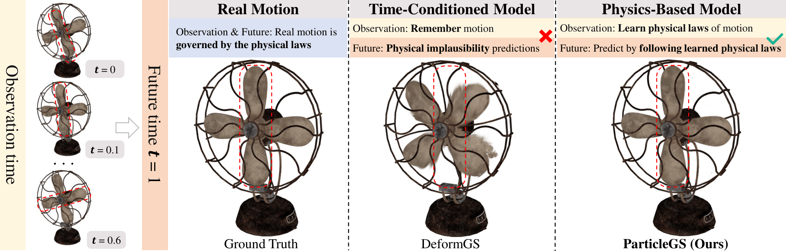

# ParticleGS(CVPR 2026 HighLight)

### Learning Neural Gaussian Particle Dynamics from Videos for Prior-free Physical Motion Extrapolation

Implementation of the paper:

> **ParticleGS: Learning Neural Gaussian Particle Dynamics from Videos for Prior-free Physical Motion Extrapolation**<br>
> Jinsheng Quan, Qiaowei Miao, Yichao Xu, Zizhuo Lin, Ying Li, Wei Yang, Zhihui Li, Yawei Luo†<br>
> Zhejiang University, North China University of Technology, Huazhong University of Science and Technology, and University of Science and Technology of China<br>
> † Corresponding author.

[[Paper](https://openaccess.thecvf.com/content/CVPR2026/papers/Quan_ParticleGS_Learning_Neural_Gaussian_Particle_Dynamics_from_Videos_for_Prior-free_CVPR_2026_paper.pdf)]



## Overview

ParticleGS learns physical motion directly from multi-view videos without predefined physical equations, material labels, meshes, or simulation supervision. It treats each 3D Gaussian as a particle and models its evolution with three components:

1. **Dynamics Latent Space Encoder** — decomposes Gaussian features into per-particle static properties and initial dynamic fields.
2. **Neural ODE Dynamics Evolver** — learns continuous-time, higher-order latent particle dynamics and integrates them with an RK4 solver.
3. **Gaussian Kernel Space Decoder** — converts evolved particle states into translation, rotation, scale, and appearance-preserving Gaussian deformation for rendering.

## Installation

### Requirements

- Python 3.9
- PyTorch 2.1.0 with CUDA 12.1 and cuDNN 8.9.2
- torchvision 0.16.0 and PyTorch3D 0.7.8

Create the Conda environment:

```bash
git clone https://github.com/QuanJinSheng/ParticleGS.git ParticleGS
cd ParticleGS

conda env create -f environment.yml
conda activate particlegs

python -m pip install --no-build-isolation ./submodules/depth-diff-gaussian-rasterization

python -m pip install --no-build-isolation ./submodules/simple-knn
```

## Datasets


For the provided Blender-style loaders, a scene normally has the following structure:

```text
dataset/
└── DynObjects/
    └── data/
        └── bat/
            ├── train/
            ├── val/
            ├── test/
            ├── transforms_train.json
            ├── transforms_val.json
            ├── transforms_test.json
            └── points3d.ply
```


## Training

Run all commands from the repository root. Training jointly optimizes the 3D Gaussians and ParticleGS deformation model.

### Example: Bat

```bash
python train.py --source_path dataset/DynObjects/data/bat --model_path output/dynobjects/bat --conf arguments/nvfiobj/bat.py --max_time 0.75
```

## Rendering and Testing

The model path contains the training configuration, so `--source_path` usually does not need to be repeated during rendering.

### Pretrained checkpoints

Checkpoints for Bat, Fan, Shark, Darkroom, and Chessboard are distributed with the
[`v1.0.0` GitHub Release](https://github.com/QuanJinSheng/ParticleGS/releases/tag/v1.0.0).
Download one scene or all scenes from the repository root:

```bash
bash scripts/download_checkpoints.sh bat
bash scripts/download_checkpoints.sh all
```


### Render the checkpoint

```bash
python render.py --model_path output/dynobjects/bat --iteration best --mode render --skip_train --skip_val
```

For the released Bat checkpoint and the standard dataset layout:

```bash
python render.py \
  --model_path checkpoints/dynobjects/bat \
  --source_path dataset/DynObjects/data/bat \
  --iteration best \
  --mode render \
  --skip_train \
  --skip_val
```

## Citation

If you find ParticleGS useful, please cite:

```bibtex
@inproceedings{quan2026particlegs,
  title     = {ParticleGS: Learning Neural Gaussian Particle Dynamics from Videos for Prior-free Physical Motion Extrapolation},
  author    = {Quan, Jinsheng and Miao, Qiaowei and Xu, Yichao and Lin, Zizhuo and Li, Ying and Yang, Wei and Li, Zhihui and Luo, Yawei},
  booktitle = {Proceedings of the IEEE/CVF Conference on Computer Vision and Pattern Recognition},
  year      = {2026}
}
```

## Acknowledgements

This implementation builds on ideas and components from [3D Gaussian Splatting](https://github.com/graphdeco-inria/gaussian-splatting), [Deformable 3D Gaussians](https://github.com/ingra14m/Deformable-3D-Gaussians), [NVFi](https://github.com/vLAR-group/NVFi), and related dynamic-scene reconstruction projects. We thank their authors for releasing their work.
